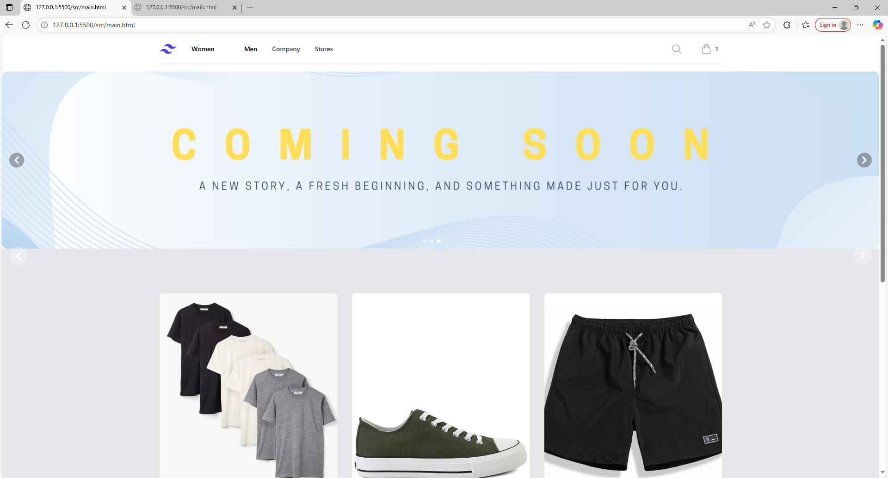
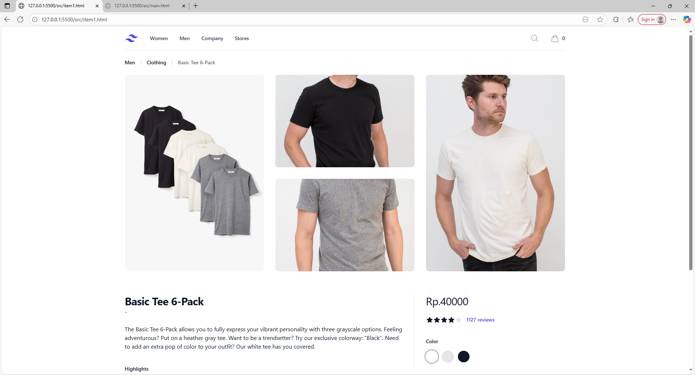
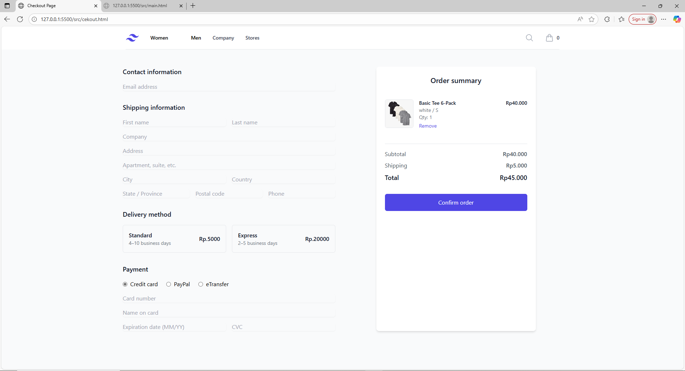
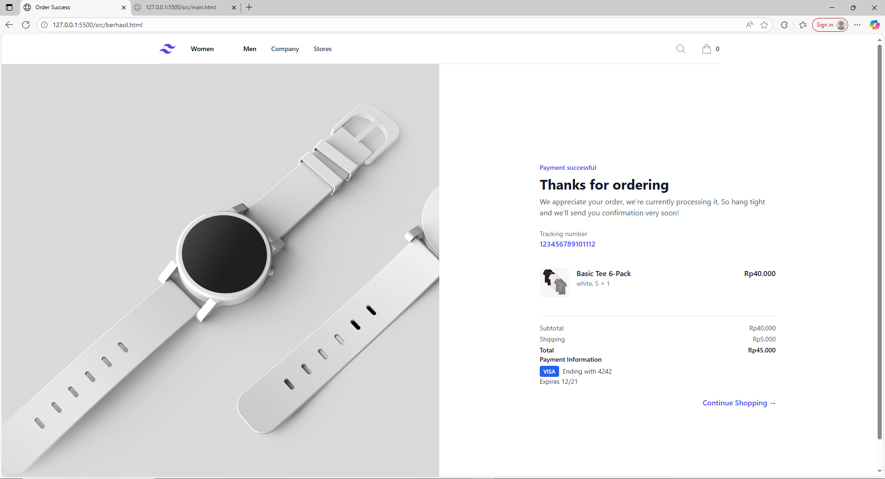

UTS PBP: Website jual beli sederhanas
Proyek ini adalah website e-commerce yang dibuat sebagai tugas UTS untuk mata kuliah PBP. Website ini memungkinkan pengguna untuk melihat produk, menambahkan ke keranjang, dan melakukan simulasi pembelian.

Demo langsung bisa diakses di sini: [Link Demo](https://youtu.be/yliGAyrvJhM)

---
Fitur
- Daftar produk dengan detail (nama, harga, gambar).  
- Keranjang belanja sederhana.  
- Simulasi proses checkout.  
- Responsif untuk tampilan desktop.

---
Teknologi yang Digunakan
- Frontend: HTML, CSS, TailwindCSS, JavaScript 

Seharusnya ada folder berisi framework dari tailwind, tapi saya tidak tau cara uploadnya untuk lebih dari 100 file

